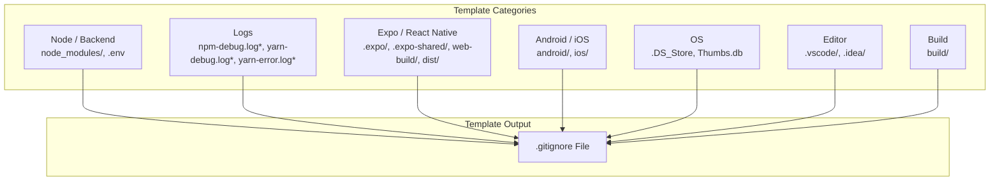
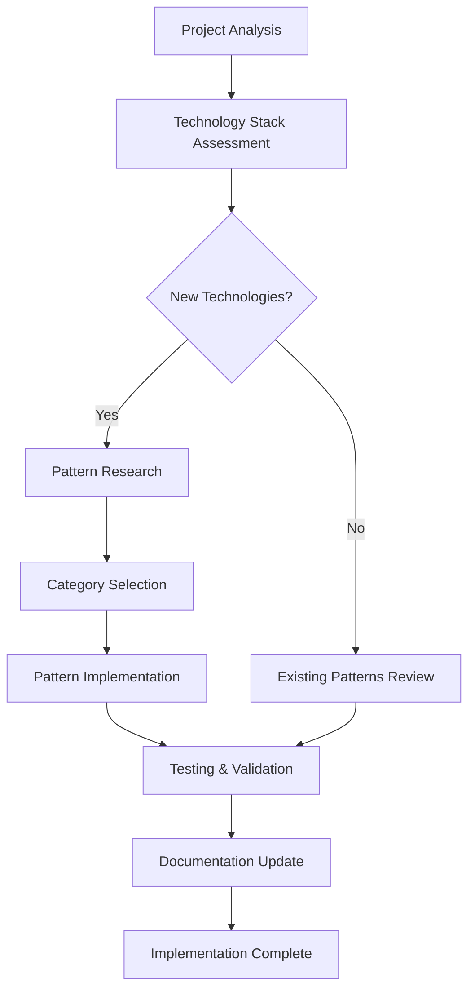

# Customization Guide

<cite>
**Referenced Files in This Document**
- [.gitignore](file://.gitignore)
</cite>

## Table of Contents
1. [Introduction](#introduction)
2. [Current Template Structure](#current-template-structure)
3. [Understanding the Base Template](#understanding-the-base-template)
4. [Customization Strategies](#customization-strategies)
5. [Common Customization Scenarios](#common-customization-scenarios)
6. [Best Practices for Modifications](#best-practices-for-modifications)
7. [Template Standardization vs. Adaptation](#template-standardization-vs-adaptation)
8. [Advanced Customization Patterns](#advanced-customization-patterns)
9. [Validation and Testing](#validation-and-testing)
10. [Maintenance Guidelines](#maintenance-guidelines)
11. [Conclusion](#conclusion)

## Introduction

This guide provides comprehensive documentation for customizing the Farely template to meet specific project requirements. The Farely template serves as a foundational starting point for modern development workflows, with the .gitignore file acting as the primary configuration mechanism for controlling which files and directories are tracked by Git. This document focuses specifically on modifying the existing ignore patterns to accommodate unique development workflows, additional technology stacks, and project-specific requirements while maintaining the template's core functionality.

The customization process involves strategic modifications to the .gitignore file that balances standardization with adaptability, ensuring that projects can evolve while preserving the template's intended structure and purpose.

## Current Template Structure

The Farely template currently provides a focused set of ignore patterns organized into logical categories:

**Diagram sources**
- [.gitignore](file://.gitignore#L1-L30)

**Section sources**
- [.gitignore](file://.gitignore#L1-L30)

## Understanding the Base Template

The base template establishes fundamental patterns for modern development environments:

### Node.js and Backend Focus
The template prioritizes Node.js development with comprehensive coverage for package management and environment configuration. The `node_modules/` exclusion prevents dependency tracking, while `.env` files are ignored to protect sensitive configuration data.

### Mobile Development Support
Built-in support for cross-platform mobile development through Expo and React Native patterns, including platform-specific build artifacts and cache directories.

### Platform Agnostic Considerations
The template accounts for various operating systems and development environments, ensuring consistent behavior across different development setups.

**Section sources**
- [.gitignore](file://.gitignore#L1-L30)

## Customization Strategies

### Strategic Modification Approaches

#### Category-Based Organization
Maintain the established category structure when adding new patterns to preserve readability and maintainability. Each new technology stack should be placed in the most appropriate existing category or integrated into the appropriate section.

#### Pattern Specificity Control
Balance specificity with generality to avoid over-matching or under-matching files. Use wildcards judiciously and consider the scope of each pattern.

#### Layered Exclusions
Implement layered exclusions where broader patterns are refined by more specific exceptions, ensuring comprehensive coverage without unnecessary complexity.

### Change Management Principles

#### Backward Compatibility
Ensure modifications don't break existing functionality or introduce conflicts with established patterns.

#### Performance Impact Assessment
Consider the impact of new patterns on Git operations, particularly for repositories with large file sets.

#### Documentation Integration
Maintain clear comments explaining the rationale behind each modification to aid future maintenance and team collaboration.

## Common Customization Scenarios

### Adding Build Tool Support

#### Gradle-based Projects
Projects requiring Gradle builds may need additional patterns for build artifacts and cache directories. Integration should follow the established build category structure.

#### Maven-based Projects  
Maven projects require specific patterns for target directories and generated artifacts. These should be added to maintain consistency with the existing build categorization.

#### Rust Cargo Projects
Cargo-based Rust projects need patterns for target directories and dependency caches, following the established build and backend categories respectively.

### Development Environment Extensions

#### IDE-Specific Configurations
Different IDEs may require additional ignore patterns for project-specific metadata and cache files. These should be categorized under the appropriate editor section.

#### Container Development
Projects using containerized development environments may need patterns for container-specific artifacts and configuration files.

#### Cloud Development Platforms
Integration with cloud development platforms may require patterns for platform-specific configuration and deployment artifacts.

### Deployment Target Support

#### Docker Containerization
Docker-based deployments require patterns for container images, Docker-specific configuration files, and build artifacts.

#### Kubernetes Manifests
Kubernetes deployments may need patterns for configuration files, secrets management, and deployment manifests.

#### Serverless Architectures
Serverless platforms require patterns for function packages, deployment artifacts, and platform-specific configuration files.

**Diagram sources**
- [.gitignore](file://.gitignore#L1-L30)

**Section sources**
- [.gitignore](file://.gitignore#L1-L30)

## Best Practices for Modifications

### Pattern Construction Guidelines

#### Specificity Hierarchy
Establish patterns from most specific to most general, allowing for proper inheritance and override behavior. This ensures that more specific patterns take precedence over general ones.

#### Comment Documentation
Every modification should include clear, descriptive comments explaining the technology, purpose, and scope of the pattern. This documentation becomes invaluable for team collaboration and future maintenance.

#### Testing Methodology
Implement a systematic testing approach to validate that patterns work as intended without unintended side effects. Test both positive and negative cases to ensure comprehensive coverage.

### Integration Patterns

#### Modular Addition
Add new patterns as modular units that can be easily removed or modified if requirements change. This modularity supports both experimentation and maintenance.

#### Conflict Resolution
Establish clear conflict resolution strategies for overlapping patterns. When conflicts arise, prioritize patterns based on specificity and project requirements.

#### Version Control Integration
Integrate pattern modifications into the project's version control workflow, ensuring that changes are tracked and reversible.

## Template Standardization vs. Adaptation

### Balancing Act Principles

#### Core Functionality Preservation
Maintain essential patterns that serve the template's primary purpose while allowing flexibility for project-specific adaptations. Core patterns should remain stable across modifications.

#### Evolutionary Approach
Adopt an evolutionary approach to customization, where patterns develop organically based on project needs rather than rigid adherence to initial assumptions.

#### Community Contribution
Consider how modifications might benefit the broader community and whether they represent generalizable solutions or highly specific adaptations.

### Decision Framework

#### Impact Assessment
Evaluate the potential impact of modifications on template usability, maintenance complexity, and adoption rate. Choose modifications that enhance rather than complicate the template.

#### Long-term Viability
Assess whether proposed modifications represent sustainable solutions or temporary fixes. Favor patterns that age well with changing technology landscapes.

#### Team Alignment
Ensure that modifications align with team preferences, skill levels, and project requirements. Consider the learning curve and maintenance burden associated with each change.

## Advanced Customization Patterns

### Conditional Exclusions
Implement conditional patterns that vary based on project configuration or environment variables. This allows for dynamic behavior without manual intervention.

### Hierarchical Organization
Organize patterns in hierarchical structures where parent categories provide broad coverage and child patterns refine specificity. This creates maintainable and scalable configurations.

### Cross-Platform Considerations
Account for differences between operating systems while maintaining consistent behavior. Use platform-specific patterns where necessary but avoid fragmentation.

### Performance Optimization
Optimize patterns for performance by minimizing the number of rules and avoiding expensive wildcard operations. Consider the impact on Git operations for large repositories.

## Validation and Testing

### Comprehensive Testing Strategy

#### Positive Testing
Verify that intended files and directories are properly excluded from version control. Test with representative files from each technology stack.

#### Negative Testing
Ensure that legitimate project files are not accidentally excluded. Test edge cases and boundary conditions to prevent false positives.

#### Integration Testing
Test patterns in combination with existing template patterns to identify conflicts and ensure compatibility.

### Quality Assurance Metrics

#### Coverage Analysis
Measure the effectiveness of patterns in covering relevant files while minimizing false positives. Track metrics such as coverage percentage and error rates.

#### Performance Benchmarking
Benchmark the impact of new patterns on Git operations, particularly for large repositories and complex file structures.

#### Maintenance Assessment
Evaluate the long-term maintainability of modifications, considering factors such as complexity, documentation quality, and team familiarity.

## Maintenance Guidelines

### Regular Review Process
Establish a regular review process for ignore patterns to ensure continued relevance and effectiveness. Technology evolves rapidly, requiring periodic updates to patterns.

### Documentation Standards
Maintain comprehensive documentation for all modifications, including rationale, alternatives considered, and testing results. This documentation supports both current and future maintenance.

### Team Coordination
Coordinate modifications across team members to ensure consistency and avoid conflicting changes. Establish clear procedures for proposing, reviewing, and implementing modifications.

### Backup and Recovery
Implement backup and recovery procedures for .gitignore modifications, allowing for quick restoration if problems arise. This provides safety nets for experimental changes.

## Conclusion

The Farely template provides a solid foundation for modern development workflows while remaining flexible enough to accommodate diverse project requirements. Effective customization involves strategic modifications that enhance rather than complicate the template's core functionality.

Key success factors include maintaining the established organizational structure, implementing thoughtful patterns with clear documentation, and establishing robust validation and testing procedures. The balance between standardization and adaptation requires careful consideration of project needs, team capabilities, and long-term maintenance requirements.

By following the guidelines and best practices outlined in this document, teams can successfully customize the Farely template to meet their specific requirements while preserving its value as a reliable foundation for development projects. The iterative nature of template customization ensures that it can evolve with changing technologies and project demands while maintaining its essential characteristics and benefits.