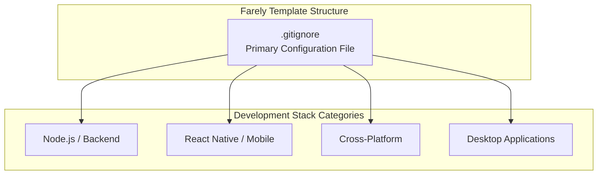
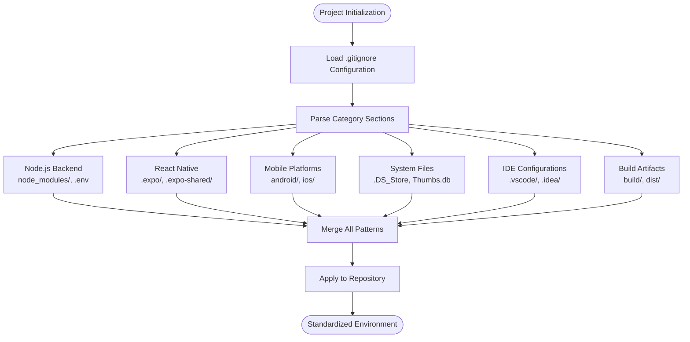
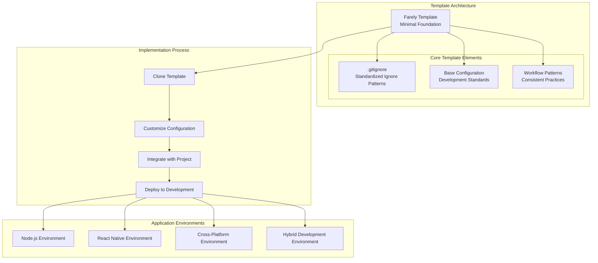
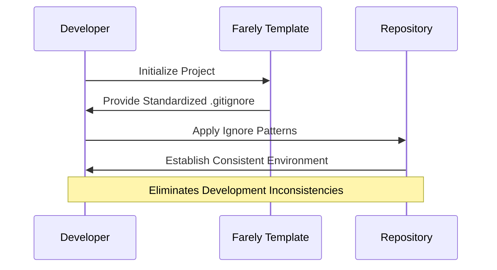
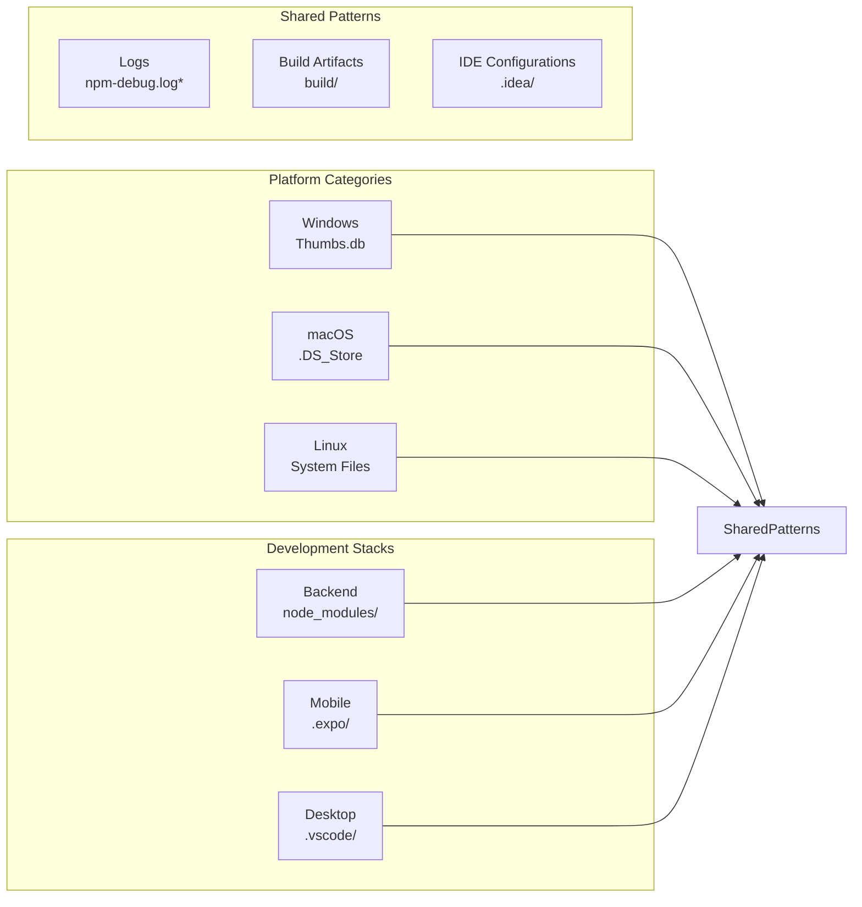

# Project Overview

<cite>
**Referenced Files in This Document**
- [.gitignore](file://.gitignore)
</cite>

## Table of Contents
1. [Introduction](#introduction)
2. [Project Structure](#project-structure)
3. [Core Components](#core-components)
4. [Architecture Overview](#architecture-overview)
5. [Development Workflow Standardization](#development-workflow-standardization)
6. [Template Pattern Implementation](#template-pattern-implementation)
7. [Cross-Platform Development Support](#cross-platform-development-support)
8. [Version Control Best Practices](#version-control-best-practices)
9. [Benefits for New Projects](#benefits-for-new-projects)
10. [Conclusion](#conclusion)

## Introduction

Farely is a minimal template project designed to serve as a standardized development workspace foundation for modern multi-stack development environments. This repository represents a carefully curated collection of version control ignore patterns that eliminates the guesswork and inconsistency commonly associated with setting up development environments across different technology stacks.

The project's primary purpose is to provide developers with a clean, pre-configured starting point that establishes consistent development practices from day one. By offering a standardized baseline configuration, Farely reduces onboarding friction for new team members and ensures that development environments remain consistent across diverse technology ecosystems.

## Project Structure

Farely maintains an intentionally minimalist structure focused on a single, critical component that defines the entire development environment's exclusion policy:

**Diagram sources**
- [.gitignore](file://.gitignore#L1-L30)

**Section sources**
- [.gitignore](file://.gitignore#L1-L30)

## Core Components

The Farely template centers around a comprehensive `.gitignore` configuration that systematically addresses the unique needs of different development stacks. This configuration serves as the foundational component that establishes consistent development practices across multiple technology environments.

### Multi-Stack Ignore Patterns

The template provides structured ignore patterns organized by development stack categories, ensuring that each technology ecosystem receives appropriate treatment:

**Diagram sources**
- [.gitignore](file://.gitignore#L1-L30)

**Section sources**
- [.gitignore](file://.gitignore#L1-L30)

## Architecture Overview

Farely implements a template/boilerplate architectural pattern that emphasizes consistency, reusability, and standardization across development environments. This approach establishes a foundation that can be replicated across multiple projects while maintaining flexibility for specific customization needs.

**Diagram sources**
- [.gitignore](file://.gitignore#L1-L30)

The architecture follows a hierarchical pattern where the template serves as the base layer, with each development stack building upon the standardized foundation established by the ignore patterns.

## Development Workflow Standardization

Farely addresses a critical gap in development workflow consistency by providing standardized ignore patterns that eliminate ambiguity and reduce onboarding overhead. The template establishes clear expectations for what should and should not be included in version control across different development contexts.

### Standardized Exclusions

The template's ignore patterns are organized to address common development scenarios:

**Section sources**
- [.gitignore](file://.gitignore#L1-L30)

## Template Pattern Implementation

Farely exemplifies the template/boilerplate pattern by providing a reusable foundation that can be adapted across multiple projects and development teams. This approach offers several advantages:

### Key Template Characteristics

- **Reusability**: Single configuration applies across multiple projects
- **Consistency**: Ensures uniform development practices
- **Scalability**: Can accommodate growing development teams
- **Maintainability**: Centralized updates and modifications

The template pattern enables organizations to establish development standards that can be consistently applied across different product lines and technology stacks.

## Cross-Platform Development Support

Farely's ignore patterns are specifically designed to support cross-platform development environments, recognizing that modern development often spans multiple operating systems and deployment targets.

### Platform-Specific Considerations

The template addresses platform-specific concerns through targeted ignore patterns:

**Diagram sources**
- [.gitignore](file://.gitignore#L1-L30)

## Version Control Best Practices

Farely demonstrates best practices for version control configuration by providing comprehensive ignore patterns that prevent sensitive data and build artifacts from entering repositories. The template's approach to version control standardization offers several key benefits:

### Security and Privacy Benefits

- **Environment Variables Protection**: Prevents accidental exposure of secrets
- **Dependency Isolation**: Avoids committing platform-specific dependencies
- **Build Artifact Management**: Keeps repositories clean and lightweight

### Performance and Organization Benefits

- **Repository Size Control**: Reduces unnecessary file storage
- **Git Operation Efficiency**: Improves performance of git operations
- **Branch Management**: Simplifies branch comparisons and merges

**Section sources**
- [.gitignore](file://.gitignore#L1-L30)

## Benefits for New Projects

Farely provides substantial advantages for teams starting new development projects:

### Reduced Setup Time

Teams can immediately benefit from pre-tested ignore patterns rather than spending time researching and configuring development environments from scratch.

### Consistency Across Teams

The standardized approach ensures that all team members work with identical development environments, reducing configuration-related issues and improving collaboration.

### Scalability and Growth

As teams expand, the template provides a foundation that can accommodate growth without requiring major infrastructure changes.

### Maintenance and Updates

Centralized configuration allows for easy updates and improvements that benefit all projects using the template.

## Conclusion

Farely represents a pragmatic solution to a common development challenge: establishing consistent, standardized development environments across diverse technology stacks. By focusing on the critical aspect of version control configuration, the template provides immediate value while remaining flexible enough to accommodate specific project requirements.

The project's minimal yet comprehensive approach demonstrates how small, well-chosen configurations can have significant positive impacts on development workflow efficiency and team productivity. Farely serves as both a practical tool and a model for how development templates can standardize best practices while maintaining the flexibility needed for successful project execution.

Through its systematic organization of ignore patterns and its emphasis on cross-platform compatibility, Farely establishes a foundation that supports modern development practices while reducing the administrative burden of environment setup and maintenance.