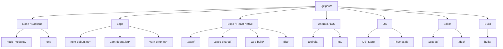
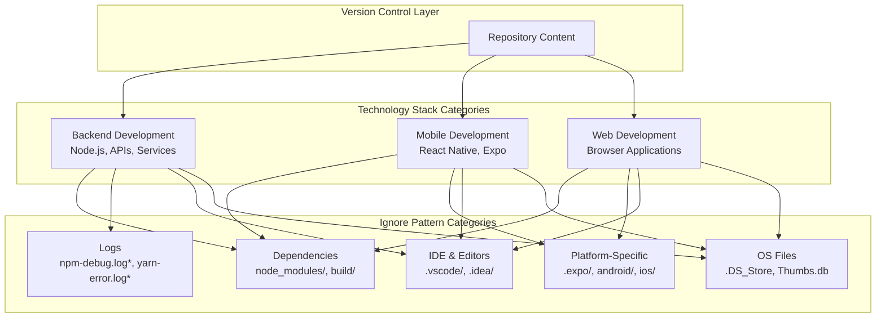
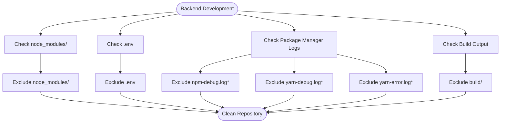
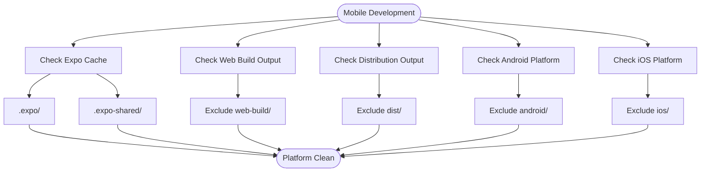
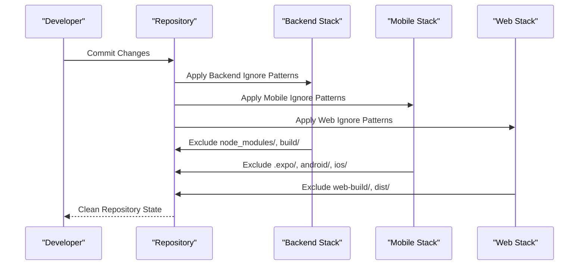
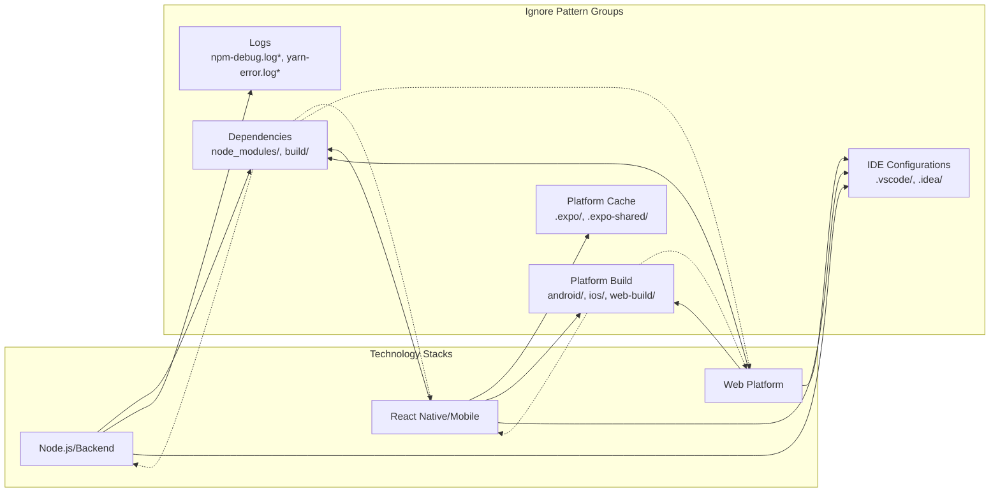

# Technology Stack Support

<cite>
**Referenced Files in This Document**
- [.gitignore](file://.gitignore)
</cite>

## Table of Contents
1. [Introduction](#introduction)
2. [Project Structure](#project-structure)
3. [Core Components](#core-components)
4. [Architecture Overview](#architecture-overview)
5. [Detailed Component Analysis](#detailed-component-analysis)
6. [Dependency Analysis](#dependency-analysis)
7. [Performance Considerations](#performance-considerations)
8. [Troubleshooting Guide](#troubleshooting-guide)
9. [Conclusion](#conclusion)

## Introduction
This document explains how the Farely template provides technology stack support through its pre-configured ignore patterns. The template is designed to accommodate multiple development environments including Node.js/Backend, React Native/Mobile, and Web platforms. The ignore patterns ensure clean version control by excluding build artifacts, dependency directories, and platform-specific files that vary across development environments.

## Project Structure
The Farely template maintains a minimal repository structure focused on essential ignore patterns for technology stack support:

**Diagram sources**
- [.gitignore](file://.gitignore#L1-L30)

**Section sources**
- [.gitignore](file://.gitignore#L1-L30)

## Core Components
The technology stack support is implemented through targeted ignore patterns organized by development category:

### Node.js/Backend Support
The template provides comprehensive support for Node.js and backend development through strategic ignore patterns:

- **Dependency Management**: `node_modules/` excludes installed packages from version control
- **Environment Configuration**: `.env` hides sensitive environment variables
- **Build Artifacts**: `build/` captures compiled output directories
- **Package Manager Logs**: npm and yarn debug/error logs prevent noise in repositories

### React Native/Mobile Support
The template includes specialized patterns for cross-platform mobile development:

- **Expo Framework**: `.expo/` and `.expo-shared/` handle Expo development cache
- **Web Build Output**: `web-build/` targets web-specific compilation artifacts
- **Distribution Builds**: `dist/` accommodates distribution package outputs
- **Platform-Specific Folders**: `android/` and `ios/` exclude platform build directories

### Cross-Platform Development Guidelines
The template supports unified development workflows across multiple platforms:

- **Shared Source Code**: Platform-agnostic code remains in version control
- **Platform-Specific Exclusions**: Platform build artifacts are isolated from shared code
- **Development Environment Isolation**: IDE and editor configurations remain separate
- **Build Output Separation**: Compiled assets are excluded from source control

**Section sources**
- [.gitignore](file://.gitignore#L1-L30)

## Architecture Overview
The technology stack support follows a layered architecture that separates concerns across different development environments:

**Diagram sources**
- [.gitignore](file://.gitignore#L1-L30)

## Detailed Component Analysis

### Node.js/Backend Technology Stack
The backend support focuses on excluding dependency management artifacts and build outputs:

**Diagram sources**
- [.gitignore](file://.gitignore#L1-L30)

**Section sources**
- [.gitignore](file://.gitignore#L1-L30)

### React Native/Mobile Technology Stack
The mobile support addresses cross-platform development with platform-specific exclusions:

**Diagram sources**
- [.gitignore](file://.gitignore#L10-L18)

**Section sources**
- [.gitignore](file://.gitignore#L10-L18)

### Cross-Platform Development Patterns
The template enables unified development across multiple platforms:

**Diagram sources**
- [.gitignore](file://.gitignore#L1-L30)

**Section sources**
- [.gitignore](file://.gitignore#L1-L30)

## Dependency Analysis
The ignore patterns create intentional dependencies between technology stacks:

**Diagram sources**
- [.gitignore](file://.gitignore#L1-L30)

**Section sources**
- [.gitignore](file://.gitignore#L1-L30)

## Performance Considerations
The ignore patterns contribute to repository performance through strategic exclusion:

- **Reduced Repository Size**: Excluding large dependency directories prevents unnecessary growth
- **Faster Cloning**: Smaller repositories clone more quickly across networks
- **Improved Git Operations**: Fewer files mean faster git status, diff, and commit operations
- **Clean Working Directory**: Developers avoid accidentally committing generated files

## Troubleshooting Guide

### Common Issues and Solutions

**Issue**: Dependencies not excluded from version control
- **Solution**: Verify `node_modules/` pattern is present in ignore file
- **Impact**: Large repository size and potential conflicts

**Issue**: Mobile build artifacts appearing in commits  
- **Solution**: Confirm platform-specific patterns are included
- **Impact**: Version control pollution with generated files

**Issue**: IDE configuration files being tracked
- **Solution**: Add appropriate editor patterns to ignore file
- **Impact**: Conflicts between team members using different editors

**Issue**: Log files consuming repository space
- **Solution**: Include package manager log patterns
- **Impact**: Unnecessary bandwidth usage during cloning

### Extension Guidelines
To extend support for additional technology stacks:

1. **Add New Category Header**: Create descriptive section headers
2. **Include Targeted Patterns**: Add patterns specific to new technologies
3. **Consider Build Artifacts**: Exclude generated output directories
4. **Test Compatibility**: Verify patterns don't conflict with existing ones
5. **Document Purpose**: Explain why specific patterns are excluded

**Section sources**
- [.gitignore](file://.gitignore#L1-L30)

## Conclusion
The Farely template provides comprehensive technology stack support through carefully curated ignore patterns. The implementation successfully accommodates Node.js/Backend, React Native/Mobile, and Web development while maintaining clean repository hygiene. The pattern organization ensures that each technology stack benefits from appropriate exclusions without interfering with others. The template serves as a foundation that can be extended to support additional technology stacks through the established pattern extension guidelines.