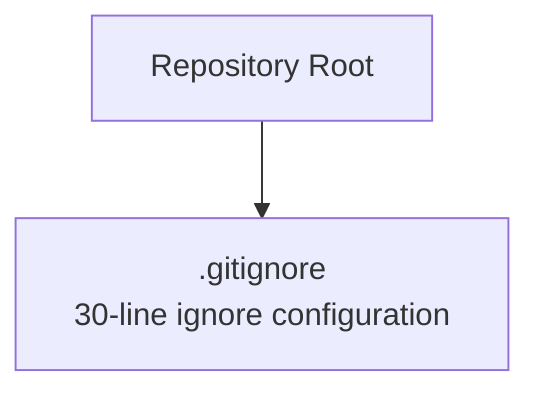
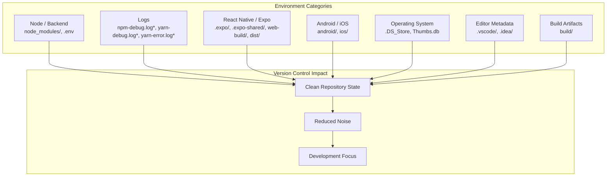
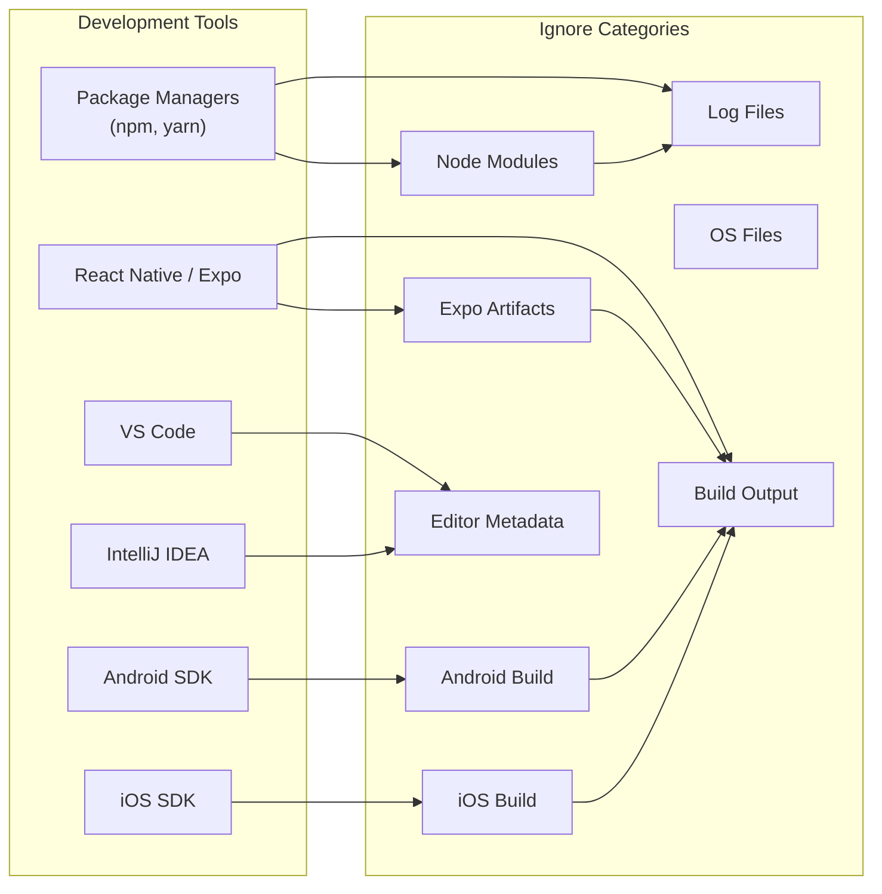

# Template Structure

<cite>
**Referenced Files in This Document**
- [.gitignore](file://.gitignore)
</cite>

## Table of Contents
1. [Introduction](#introduction)
2. [Project Structure](#project-structure)
3. [Core Components](#core-components)
4. [Architecture Overview](#architecture-overview)
5. [Detailed Component Analysis](#detailed-component-analysis)
6. [Dependency Analysis](#dependency-analysis)
7. [Performance Considerations](#performance-considerations)
8. [Troubleshooting Guide](#troubleshooting-guide)
9. [Conclusion](#conclusion)

## Introduction
This document explains the Farely template structure with emphasis on the .gitignore file and its 30-line ignore pattern configuration. The .gitignore file organizes patterns into logical categories to support multiple development environments and technology stacks. It ensures clean version control repositories by preventing unnecessary files from being tracked, while preparing the workspace for Node.js backend projects, React Native applications, Android/iOS mobile development, and general build artifacts.

## Project Structure
The repository root contains a single file that defines the ignore patterns for the template. The structure is minimal and focused, reflecting a template designed to provide sensible defaults for common development scenarios.

**Diagram sources**
- [.gitignore](file://.gitignore#L1-L30)

**Section sources**
- [.gitignore](file://.gitignore#L1-L30)

## Core Components
The .gitignore file serves as the central component of the template structure. It groups ignore patterns into categories that align with typical development workflows and technology stacks. The patterns are organized to minimize noise in version control while enabling efficient local development across diverse environments.

Key characteristics:
- Categorized patterns for Node.js/backend development
- Dedicated sections for logs, temporary artifacts, and IDE/editor metadata
- Support for React Native/Expo projects and native mobile platforms
- Operating system-specific files and directories
- Build artifacts and distribution folders

**Section sources**
- [.gitignore](file://.gitignore#L1-L30)

## Architecture Overview
The .gitignore file acts as a policy layer that standardizes what gets excluded from version control across different development contexts. The categorization follows a logical progression from environment-specific directories to general cleanup patterns.

**Diagram sources**
- [.gitignore](file://.gitignore#L1-L30)

## Detailed Component Analysis

### Category 1: Node.js / Backend Development
Purpose: Exclude package management and environment-specific files commonly generated during backend development.

Patterns included:
- Package manager cache and installed dependencies directory
- Environment configuration files that may contain secrets

Benefits:
- Prevents accidental commits of sensitive configuration data
- Keeps version control focused on source code and configuration
- Reduces repository size by excluding large dependency trees

**Section sources**
- [.gitignore](file://.gitignore#L1-L4)

### Category 2: Log Files
Purpose: Remove log files generated by package managers and build processes.

Patterns included:
- npm debug logs
- yarn debug and error logs

Benefits:
- Eliminates transient log files from version control
- Prevents log pollution in repositories
- Reduces repository bloat caused by frequently changing log files

**Section sources**
- [.gitignore](file://.gitignore#L5-L8)

### Category 3: React Native / Expo Ecosystem
Purpose: Support cross-platform mobile development with React Native and Expo.

Patterns included:
- Expo runtime and caching directories
- Web build outputs
- Distribution packages

Benefits:
- Enables seamless development with Expo CLI and Metro bundler
- Prevents platform-specific build artifacts from cluttering repositories
- Supports both web and native builds without interference

**Section sources**
- [.gitignore](file://.gitignore#L10-L14)

### Category 4: Android / iOS Platforms
Purpose: Exclude platform-specific build outputs and generated files.

Patterns included:
- Android build directories
- iOS build directories

Benefits:
- Prevents platform-specific binaries and intermediate files from being tracked
- Reduces repository size for mobile projects
- Maintains separation between source code and platform outputs

**Section sources**
- [.gitignore](file://.gitignore#L16-L18)

### Category 5: Operating System Files
Purpose: Remove operating system-generated files that vary across platforms.

Patterns included:
- macOS resource forks and metadata
- Windows thumbnail cache files

Benefits:
- Ensures cross-platform compatibility
- Prevents OS-specific metadata from leaking into repositories
- Maintains consistent repository state across different operating systems

**Section sources**
- [.gitignore](file://.gitignore#L20-L22)

### Category 6: Editor and IDE Metadata
Purpose: Exclude editor-specific configuration and cache files.

Patterns included:
- VS Code workspace and settings
- IntelliJ/WebStorm project metadata

Benefits:
- Prevents editor-specific configurations from being shared across teams
- Reduces repository bloat from IDE caches
- Maintains team flexibility in development tool choices

**Section sources**
- [.gitignore](file://.gitignore#L24-L26)

### Category 7: Build Artifacts
Purpose: Remove compiled outputs and distribution packages.

Patterns included:
- Generic build directories

Benefits:
- Keeps repositories clean of generated files
- Prevents accidental commits of production-ready artifacts
- Supports iterative development without clutter

**Section sources**
- [.gitignore](file://.gitignore#L28-L30)

## Dependency Analysis
The .gitignore file creates dependencies between development environments and their respective ignore patterns. Each category depends on specific tooling and workflows:

**Diagram sources**
- [.gitignore](file://.gitignore#L1-L30)

**Section sources**
- [.gitignore](file://.gitignore#L1-L30)

## Performance Considerations
The .gitignore configuration contributes to repository performance in several ways:

- Reduced repository size through exclusion of large directories (node_modules, build outputs)
- Faster clone and fetch operations by avoiding unnecessary files
- Improved git status performance by reducing the number of tracked files
- Lower bandwidth usage during remote operations

Best practices for maintaining performance:
- Keep ignore patterns specific to avoid over-exclusion
- Regularly review and update patterns as new tools emerge
- Consider environment-specific variations for different team setups

## Troubleshooting Guide

Common issues and solutions:

### Issue: Files still being tracked despite ignore patterns
- Verify the patterns match actual file locations and names
- Check for leading/trailing spaces or incorrect wildcards
- Ensure the .gitignore file is committed to the repository

### Issue: Platform-specific files appearing in repositories
- Confirm OS-specific patterns are present for the relevant platforms
- Verify cross-platform compatibility of ignore patterns

### Issue: IDE metadata interfering with team collaboration
- Ensure editor-specific patterns are comprehensive
- Consider adding team-wide editor preferences separately from .gitignore

### Issue: Build artifacts causing repository bloat
- Verify build directory patterns match actual output locations
- Consider environment-specific build directories

**Section sources**
- [.gitignore](file://.gitignore#L1-L30)

## Conclusion
The .gitignore file in the Farely template provides a comprehensive foundation for maintaining clean version control repositories across multiple development environments. Its categorical organization ensures that different technology stacks receive appropriate treatment while maintaining simplicity and effectiveness. By excluding environment-specific files, logs, build artifacts, and editor metadata, the template enables teams to focus on source code and configuration while supporting diverse development workflows.

The 30-line configuration covers essential patterns for Node.js/backend development, React Native/Expo projects, Android/iOS mobile development, and general cleanup scenarios. This approach balances comprehensiveness with maintainability, providing a solid foundation that can be adapted as project requirements evolve.