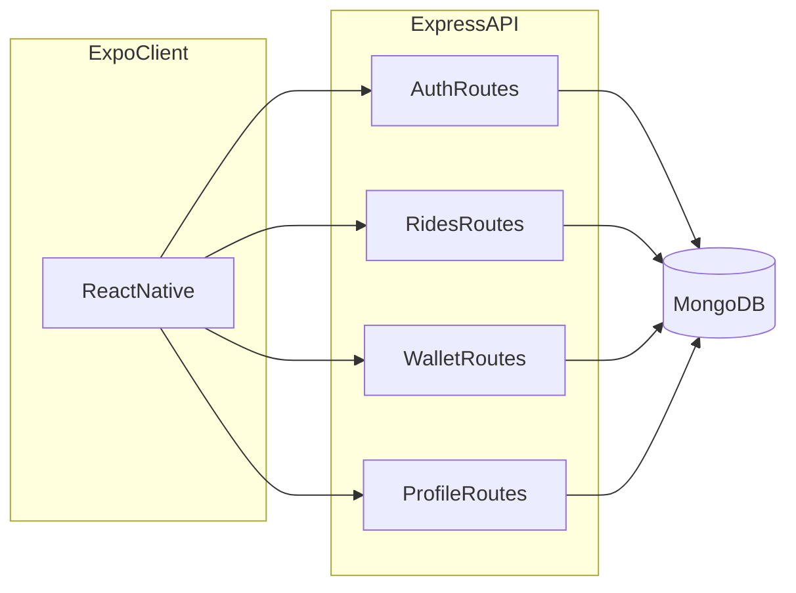

# Farely — Project Defence Report (Outline)

**Document type:** Section headings and bullet prompts only (no body prose). Expand each prompt into paragraphs for the final submission.

**Target length when expanded:** approximately 20+ pages (adjust subsection depth if your supervisor requires more literature, testing, or diagrams).

**Note to author:** Fill front matter, insert screenshots where placeholders appear, and align claims with the current codebase.

---

## Front matter

### Title page (prompts)

- State project title: **Farely** (or full formal title from your institution).
- List student name(s), roll number(s), degree program, session.
- Supervisor name and affiliation.
- Institution name, department, city, country.
- Submission date / defence date.

### Abstract (prompts)

- **Problem:** In one sentence, describe manual fare comparison across multiple ride-hailing apps in Pakistan (context: Careem, Yango, inDrive — academic context only).
- **Gap:** What users lack today (time, cognitive load, no single view of fares).
- **Objective:** Deliver a mobile-first app that compares estimated fares and redirects users to provider apps where booking is completed.
- **Method:** React Native (Expo) client, Node.js/Express REST API, MongoDB, JWT authentication, estimation engine, deep-link/fallback redirection.
- **Key results:** List 3-5 concrete outcomes (working auth flows, estimate comparison API, deep-link redirect flow, admin monitoring panel, profile/support operations).
- **Conclusion line:** One sentence on feasibility and contribution of the FYP.

### Keywords (prompts)

- Suggest 5–8 keywords, e.g.: ride-hailing, fare comparison, mobile application, React Native, Node.js, MongoDB, REST API, JWT, digital wallet.

---

## Chapter 1 — Introduction

### 1.1 Background

- Describe growth of ride-hailing in urban Pakistan (general, cited).
- Explain **multi-homing**: users installing more than one app.
- Explain why comparing fares across apps is tedious (switching apps, re-typing locations).
- Position Farely as a **fare comparison + redirect aggregator** (not a replacement for provider contracts).

### 1.2 Problem statement

- Quote or paraphrase the problem from repository root [`README.md`](../README.md).
- If available, add any survey count, interview snippet, or anecdote (cite source).
- State the core problem in one formal sentence suitable for marking rubrics.

### 1.3 Objectives

- **Primary objectives (SMART where possible):**
  - Enable user registration/login with secure session handling.
  - Obtain pickup/destination and show comparable fare options.
  - Support provider app handoff via deep link/fallback for final booking.
  - Provide operational monitoring through admin views (searches, provider selections, support).
- **Secondary objectives:**
  - Profile completion and photo upload (if enabled in build).
  - Account security: forgot-password vs change-password distinction.
  - Usable UI on Android/iOS builds.

### 1.4 Scope

- **In scope:** Features present in the current codebase (list after skimming Ch. 3).
- **Out of scope:** Examples — production payment service provider integration, native driver app, fleet operations dashboard, government licensing discussion (unless required by course).
- **Assumptions:** Backend reachable, API keys configured for maps/places where used, demo/simulation behaviour for drivers if applicable.

### 1.5 Report organization

- Write one paragraph mapping each subsequent chapter to content: “Chapter 2 reviews … Chapter 3 specifies …” through Chapter 8.

---

## Chapter 2 — Literature review and related work

### 2.1 Ride-hailing market and user behaviour

- Summarize how academic/industry sources describe ride-hailing adoption.
- Define **multi-homing** and why price comparison matters.
- Cite 2–4 reputable sources (IEEE, ACM, transport journals, or official reports).

### 2.2 Related systems and products

- Name categories: single-provider apps vs aggregators vs map-based estimates.
- Compare at feature level (comparison table): account model, payment, coverage.
- State what is publicly known about APIs (without violating terms of use in your writing).

### 2.3 Gap analysis

- Contrast manual comparison with a **dedicated comparison workflow**.
- State clearly what Farely implements vs what commercial aggregators do (be honest).
- Tie gap to objectives in §1.3.

### 2.4 Summary

- Three bullets: takeaway for your examiner.

---

## Chapter 3 — Requirements specification

### 3.1 Stakeholders

- Identify: end user (rider), developer (you), supervisor, future maintainer.

### 3.2 Functional requirements

For each numbered FR, state **what** the system shall do; reference module/screen where implemented.

- **FR-AUTH:** Signup with OTP channel; verify OTP; set password; login; optional Google sign-in; logout; token persistence.
- **FR-AUTH-RESET:** Forgot password (OTP) → reset password (identifier + channel).
- **FR-AUTH-CHANGE:** Logged-in change password (current + new + confirm) via Bearer token.
- **FR-PROFILE:** View/update profile; optional profile photo upload.
- **FR-LOCATION:** Map/home flow; location search; pickup/destination handoff (as in app).
- **FR-RIDES:** Minimum fare estimate for coordinates and ride type; compare estimated list; redirect action to provider app.
- **FR-RIDE-UI:** Post-booking chat/contact flows; ride widget context (if described).
- **FR-WALLET:** Balance; history; top-up; pay ride (idempotent rules as implemented).
- **FR-SETTINGS:** Menu, notifications list, legal screens, app settings (local prefs).

### 3.3 Non-functional requirements

- **NFR-PERF:** Response time expectations for API calls; map rendering considerations.
- **NFR-SEC:** HTTPS in deployment; JWT; password hashing; validation middleware; least privilege for protected routes.
- **NFR-USABILITY:** Mobile-first layout; accessibility aspirations (font sizes, touch targets).
- **NFR-MAINTAIN:** Modular routes/controllers; environment-based configuration.

### 3.4 Constraints

- Hardware: smartphone; network dependency.
- Software: Expo/React Native version; Node LTS; MongoDB.
- Regulatory: mention data privacy at high level (user data in DB; photos in object storage if used).

### 3.5 Use cases / user stories

- Provide a **use case diagram** (tool: Draw.io, Lucidchart, or PlantUML) — prompts:
  - Actors: Guest, Registered user, System (API).
  - Use cases: Register, Login, Compare fares, Book ride, Top-up wallet, View history, Change password.
- Optional **sequence diagram** for: Login → token stored → authorized `/rides/estimate-min`.

### 3.6 Requirements traceability (prompts)

- Build a table: Requirement ID | Screen/API | Test case ID (fill in Ch. 6).

---

## Chapter 4 — System design

### 4.1 Architectural overview

- Describe **three-tier** pattern: presentation (Expo) → application (Express) → data (MongoDB).
- Note synchronous REST; stateless server with JWT.
- Insert architecture diagram (reuse or extend mermaid below).

### 4.2 Frontend structure

- Explain root navigation: [`frontend/App.js`](../frontend/App.js) — stack navigator, auth vs unauthenticated branches, tab navigator for main app.
- List **primary screens** under [`frontend/src/screens/`](../frontend/src/screens/) (see Appendix D).
- Mention shared context (e.g. auth, ride widget) at high level — file names only.

### 4.3 Backend structure

- Explain Express app entry [`backend/server.js`](../backend/server.js): middleware order, route mounting, global `/auth/me`, error handler.
- Map folders: [`backend/routes/`](../backend/routes/), [`backend/controller/`](../backend/controller/), [`backend/middleware/`](../backend/middleware/), [`backend/services/`](../backend/services/), [`backend/validators/`](../backend/validators/).

### 4.4 Data model

- For each model file in [`backend/model/`](../backend/model/), summarize entities and key fields:
  - `User.model.js` — identifiers, password hash, profile fields, wallet linkage if any.
  - `Wallet.model.js` — balance, user reference.
  - `Transaction.model.js` — types, amounts, references.
  - `OtpVerification.model.js` — OTP lifecycle, purposes (signup vs forgot_password).

### 4.5 API design

- REST conventions; JSON bodies; `Authorization: Bearer` for protected routes.
- Reference **Appendix A** for full path list.
- Explain difference: **public** auth routes vs **`protect`** middleware ([`backend/middleware/auth.middleware.js`](../backend/middleware/auth.middleware.js)).

### 4.6 Security design

- JWT issuance and verification; token storage on client (AsyncStorage — state trade-off for FYP).
- Password policy alignment with validators ([`backend/validators/auth.validator.js`](../backend/validators/auth.validator.js)).
- **Forgot/reset** flow (identifier + channel + OTP) vs **change-password** (Bearer + current password) — cite controller: [`backend/controller/auth.controller.js`](../backend/controller/auth.controller.js).
- CORS and environment variables (no secrets in client source).

### 4.7 Third-party integrations

- Google Maps / Places (keys from Expo config — describe without pasting secrets).
- Optional email/SMS/Twilio (as per `.env` — describe behaviour generically).
- Object storage for profile photos if [`backend/services/s3.service.js`](../backend/services/s3.service.js) is used.

### 4.8 Design decisions and trade-offs

- Why MongoDB (flexible schema, FYP speed, rapid admin analytics logs).
- Why Expo (iteration speed, OTA optional).
- Known coupling points (API URL in frontend config).

---

## Chapter 5 — Implementation

### 5.1 Frontend implementation

- Navigation patterns: stack depth, `navigationRef` usage for menu (if applicable).
- Key user journeys with **file references**:
  - Home / map: [`frontend/src/screens/HomeScreen.js`](../frontend/src/screens/HomeScreen.js)
  - Location search: [`frontend/src/screens/LocationSearchScreen.js`](../frontend/src/screens/LocationSearchScreen.js)
  - Ride options: [`frontend/src/screens/RideOptionsScreen.js`](../frontend/src/screens/RideOptionsScreen.js)
  - Chat: [`frontend/src/screens/ChatScreen.js`](../frontend/src/screens/ChatScreen.js)
  - Wallet: [`frontend/src/screens/WalletScreen.js`](../frontend/src/screens/WalletScreen.js)
  - Change password: [`frontend/src/screens/ChangePasswordScreen.js`](../frontend/src/screens/ChangePasswordScreen.js)
- API client: [`frontend/src/api/farelyApi.js`](../frontend/src/api/farelyApi.js) — interceptors, 401 handling.

### 5.2 Backend implementation

- Controller responsibilities vs services (rides simulation, OTP, email — point to actual files).
- Validation pipeline: express-validator + [`validate.middleware`](../backend/middleware/validate.middleware.js).
- Consistent JSON error shape via [`error.middleware`](../backend/middleware/error.middleware.js).

### 5.3 Authentication flows (implementation detail)

- List endpoints in order for: signup → OTP → set password.
- List endpoints for: forgot → verify → reset.
- Single paragraph on change-password success issuing new JWT (if still true in code).

### 5.4 Wallet implementation

- Describe balance update rules at high level; reference wallet controller.
- Idempotency prompt for pay endpoint (as per code comments).

### 5.5 Build and run

- Backend: `npm` scripts from [`backend/README.md`](../backend/README.md) or `package.json`.
- Frontend: Expo scripts from [`frontend/package.json`](../frontend/package.json).
- Environment: reference [`backend/.env.example`](../backend/.env.example) if present (never commit real `.env`).

### 5.6 Versioning and repository

- Link to Git repo; branch strategy if any (e.g. `dev`).

---

## Chapter 6 — Testing and validation

### 6.1 Test strategy

- State manual testing as primary for FYP (if no automated suite).
- API testing with Postman: [`backend/postman/Farely-API.postman_collection.json`](../backend/postman/Farely-API.postman_collection.json).
- Device testing: Android emulator / physical device; iOS if applicable.

### 6.2 Test cases (template)

- Create a table: **TC-ID | Preconditions | Steps | Expected | Actual | Pass/Fail**.
- Minimum suggested cases:
  - TC-AUTH-01 Login valid / invalid password.
  - TC-AUTH-02 Change password wrong current password (expect 400, token not cleared).
  - TC-RIDE-01 Estimate-min with valid coordinates.
  - TC-RIDE-02 Compare/book happy path (per simulation).
  - TC-WALLET-01 Balance after top-up; history row appears.
  - TC-PROF-01 Profile update persists after `getMe`.

### 6.3 Non-functional checks

- Cold start time (qualitative).
- Navigation back-stack behaviour (related to gesture-handler / screens).

### 6.4 Known limitations (honesty)

- Simulated or demo driver behaviour if applicable.
- Fare values are estimates; final fare and booking occur in provider apps.
- Maps dependency on API keys and quotas.

### 6.5 Test conclusion

- Two bullets: readiness for defence demo vs production gaps.

---

## Chapter 7 — Results and discussion

### 7.1 Functional results

- Map each objective in §1.3 to evidence (screen/API).

### 7.2 Defence demo script (≈5 minutes)

- Bullet script:
  1. Open app → login or register (short path).
  2. Show home/map → open location search → confirm pickup/destination.
  3. Show fare list / ride options → trigger book flow → chat or status screen.
  4. Open wallet → show balance/history → optional top-up.
  5. Account → change password or cite forgot-password as separate flow.
  6. Close with one limitation + future work.

### 7.3 Screenshots checklist

- [ ] Onboarding / Welcome
- [ ] Login / Signup
- [ ] Home / map
- [ ] Location search
- [ ] Ride options / compare
- [ ] Chat / ride in progress
- [ ] Wallet
- [ ] Profile / complete profile
- [ ] Menu / account settings
- [ ] Change password
- [ ] Notifications (if used)

### 7.4 Discussion

- Challenges: maps integration, async state, navigation complexity, build issues.
- What you would refactor first with more time.

---

## Chapter 8 — Conclusion and future work

### 8.1 Conclusion

- Restate problem and solution in past tense.
- Summarize alignment with objectives.

### 8.2 Future work

- Expanded provider deep-link coverage and intent templates.
- Better confidence modeling for estimated fare ranges.
- Provider partnerships for richer handoff tracking APIs.
- Fraud prevention, rate limiting, audit logs.
- Localization (Urdu/English).
- Automated tests (Jest, Supertest).

### 8.3 Final remarks

- One paragraph personal learning outcome.

---

## References

### Prompts

- Choose citation style required by your department (IEEE / APA / Harvard).
- Minimum suggested categories: ride-hailing industry report, security (JWT/OAuth), mobile HCI, one MongoDB or REST textbook chapter.
- Use consistent formatting; include DOI/URL and access date for web sources.

---

## Appendices

### Appendix A — API summary (base URL + `/auth`, `/profile`, `/rides`, `/wallet`)

| Method | Path | Auth | Purpose |
|--------|------|------|---------|
| GET | `/` | No | Health |
| POST | `/auth/signup` | No | Start signup, send OTP |
| POST | `/auth/resend-otp` | No | Resend OTP |
| POST | `/auth/verify-otp` | No | Verify OTP (signup / forgot) |
| POST | `/auth/set-password` | No | Set password after signup OTP |
| POST | `/auth/login` | No | Login |
| POST | `/auth/google` | No | Google ID token login |
| POST | `/auth/forgot-password` | No | Request forgot-password OTP |
| POST | `/auth/verify-forgot-password-otp` | No | Verify forgot OTP |
| POST | `/auth/reset-password` | No | Reset password after OTP |
| POST | `/auth/change-password` | **Bearer** | Logged-in change password |
| GET | `/auth/me` | **Bearer** | Current user |
| GET | `/profile/` | **Bearer** | Profile |
| PUT | `/profile/` | **Bearer** | Update profile |
| POST | `/profile/photo` | **Bearer** | Upload photo |
| POST | `/rides/compare` | **Bearer** | Compare / book action |
| POST | `/rides/estimate-min` | **Bearer** | Min fare estimate |
| GET | `/wallet/balance` | **Bearer** | Wallet balance |
| GET | `/wallet/history` | **Bearer** | Transactions |
| POST | `/wallet/topup` | **Bearer** | Top-up |
| POST | `/wallet/pay` | **Bearer** | Pay ride |

*Verify against [`backend/server.js`](../backend/server.js) and route files if routes change.*

### Appendix B — MongoDB collections / models

- List collections implied by [`backend/model/`](../backend/model/) files.
- Optional ERD diagram: User ↔ Wallet ↔ Transaction; OTP as supporting collection.

### Appendix C — User quick start (prompts)

- Steps: clone repo → install backend → set `.env` → start MongoDB → run server → install frontend → set API URL → `expo run:android` / `ios`.
- Point to [`README.md`](../README.md) and package READMEs.

### Appendix D — Frontend screens index

Screens under [`frontend/src/screens/`](../frontend/src/screens/): About, AccountSettings, AppSettings, CardSettings, ChangePassword, Chat, CompleteProfile, ForgotPasswordSend, ForgotPasswordSetNew, HelpSupport, Home, LocationSearch, Login, Menu, Notification, Onboarding, Payment, PaymentMethods, PrivacyPolicy, Profile, RideOptions, SetPassword, Signup, Terms, VerifyOtp, Wallet, Welcome.

### Appendix E — Report-to-repository mapping (for evidence)

| Report section | Primary paths |
|----------------|---------------|
| Ch. 4 Architecture | [`backend/server.js`](../backend/server.js), [`frontend/App.js`](../frontend/App.js) |
| Ch. 4 Security | [`backend/middleware/auth.middleware.js`](../backend/middleware/auth.middleware.js), [`backend/controller/auth.controller.js`](../backend/controller/auth.controller.js) |
| Ch. 5 Frontend UI | [`frontend/src/screens/`](../frontend/src/screens/), [`frontend/src/api/`](../frontend/src/api/) |
| Ch. 5 Backend API | [`backend/routes/`](../backend/routes/), [`backend/controller/`](../backend/controller/) |
| Ch. 6 Testing | [`backend/postman/`](../backend/postman/) |
| Ch. 7 Demo | Build APK/emulator + walkthrough script in §7.2 |

---

## Author checklist (page budget)

- [ ] Expand each subsection with 0.5–2 pages as needed to reach **20+ pages** total (figures/tables count).
- [ ] Insert figure numbers and captions for all diagrams.
- [ ] Run spell-check; unify terminology (Farely, ride-hailing, fare comparison).
- [ ] Supervisor review against departmental rubric.

---

*End of outline.*
