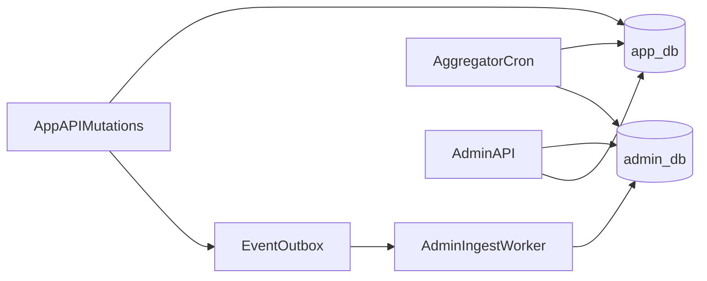

# Farely Admin Dataflow and DB Split

This document defines exactly how data moves between `app_db` and `admin_db`
for the future admin backend.

## Chosen deployment model

- Same Mongo cluster
- Two logical databases:
  - `app_db` (source of truth for rider app writes)
  - `admin_db` (optimized read models for admin UI)

## Why split this way

- Keep mobile app transactional paths small and fast.
- Keep admin analytics queries isolated from user-facing API load.
- Allow admin schemas to evolve independently from mobile app schemas.

## Data ownership

## `app_db` ownership

- User accounts and auth for rider app
- Ride searches / provider selections / handoffs / confirmations
- In-app support submissions

## `admin_db` ownership

- Admin users, sessions, RBAC and audit logs
- Support thread denormalized views
- Traffic and hotspot aggregates
- Reply delivery status and mailbox metadata

## Data transfer strategy

Use hybrid transfer:

1. **Event-driven upserts** for near real-time cards/tables
2. **Scheduled aggregation jobs** for charts/hotspots



## Event contract list

Events emitted by app backend:

- `ride.search.created`
- `ride.provider_selection.created`
- `ride.handoff.created`
- `ride.handoff.confirmed`
- `ride.handoff.rejected`
- `support.thread.created` (from app feedback form)

Required event envelope:

```json
{
  "eventId": "uuid",
  "eventType": "ride.handoff.created",
  "entityId": "mongo_id",
  "occurredAt": "2026-04-24T12:00:00.000Z",
  "version": 1,
  "payload": {}
}
```

## Snapshot tables in admin_db

- `ride_events_snapshot`
  - source ids and denormalized route/provider/status fields
- `traffic_daily_metrics`
  - per day/provider/city/rideType counters and conversion
- `hotspot_tiles`
  - geohash/tile level demand and success rates
- `support_threads_view`
  - thread list optimized for inbox sidebar

## Aggregation schedule

- Near-real-time ingest worker: every 5-15 seconds polling outbox
- Hourly hotspot refresh: recompute last 24h and last 7d windows
- Daily traffic rollup: compute previous day immutable totals
- Backfill runner: manual script for historical rebuild

## Reliability and replay

- Outbox table/state includes `processedAt`, `attemptCount`, `lastError`.
- Worker idempotency key: `eventId` unique in `admin_db.ingest_events`.
- Poison queue policy: after N failures mark dead-letter and alert ops.
- Reconciliation job compares counts from source and snapshots daily.

## Query routing rules

- Admin chart endpoints read **only** from `admin_db` aggregates.
- Admin drill-down endpoint may read source docs from `app_db`.
- Support inbox list/timeline reads from `admin_db` views/messages.

## Performance and safety requirements

- Cursor pagination everywhere (`limit` default 25, max 100).
- Compound indexes:
  - `ride_events_snapshot`: `(createdAt desc, provider, status, city)`
  - `traffic_daily_metrics`: `(date, provider, city, rideType)`
  - `hotspot_tiles`: `(windowStart, city, tileKey)`
- SLA:
  - event ingest lag target < 30s
  - chart freshness target < 5m for hourly metrics

## Migration plan

1. Add outbox writes in current app backend mutations.
2. Introduce admin ingest worker and idempotent sink collections.
3. Enable new admin APIs against admin_db snapshots.
4. Activate schedulers and reconciliation alerts.
5. Deprecate direct heavy reads from app_db in admin endpoints.
