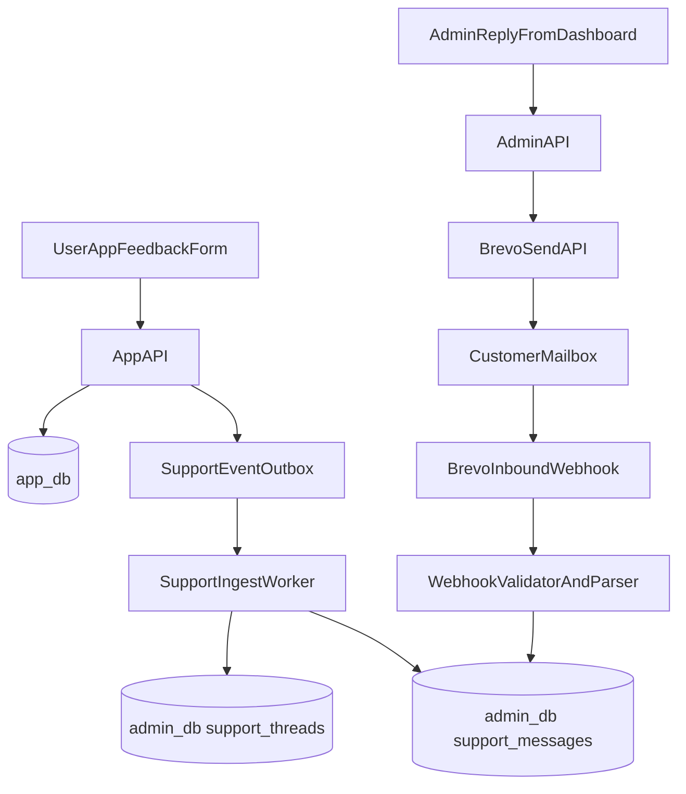

# Support Inbox Lifecycle (Single Channel via Brevo)

This defines one unified communication path so support does not fragment.

## Operational note — email ingress

Inbound email in this design is delivered through Brevo after DNS (MX) is configured on a domain under the operator’s control. If that step is not deployed, the **Gmail → Brevo → webhook** path is out of scope until domain and inbound setup are completed (see [GMAIL_SUPPORT_FORWARD_TO_BREVO.md](./GMAIL_SUPPORT_FORWARD_TO_BREVO.md), “Scope without a registered domain” and Phase 1–2). The rest of this document describes the **intended** lifecycle once email ingress is active.

### What appears in the Support Inbox list

Each row is a `support_threads` document. Origin is indicated by `source`:

| `source` | Origin | Shown without email / Brevo inbound? |
|----------|--------|--------------------------------------|
| `in_app` | User submits from **Help & support → Message from the app** (or any client of `POST /support/tickets`): `SupportTicket` in app DB → outbox `support.thread.created` → Admin **ingest** upserts `support_threads` and first `support_messages` (`channel: in_app`). | **Yes** — needs app outbox, ingest worker, and Admin API only. |
| `email` | Mail hits the Brevo inbound address; **POST /webhooks/brevo/inbound** creates or updates the thread and messages. | **No** — needs verified domain, MX, public webhook URL, and Brevo configuration. |

**Outside this screen:** routine **customer email** (e.g. a shared Gmail inbox) is not copied here until the email ingress above is live. **In-app feedback** (ratings / survey copy) is ingested into **`feedback_entries`** for the Feedback view; it is a separate pipeline from `support_threads` unless the product explicitly links them later.

## Practical flow — two stories and a lab activity

Think of **two doors** into the same Support Inbox UI. Only **Door A** works without buying a domain or wiring Brevo inbound.

### Story A — `in_app` (Door A: inside the Farely app)

**Characters:** A user **Ahmed**, the **Farely main backend** (app API + Mongo), the **ingest worker** in Admin, you as **admin** in the browser.

1. Ahmed opens the Farely app → **Menu → Help & support** → under *Email us*, uses **Message from the app** (multiline text) → taps **Send to Farely** (HTTP `POST /support/tickets` on the main Farely API).
2. The **main backend** saves a row in **`SupportTicket`** (app database) and appends an **outbox** event named **`support.thread.created`** (so the Admin side can pick it up later without calling Brevo).
3. The **Admin ingest worker** (separate process/service) reads that outbox event and writes into **`admin_db.support_threads`** with **`source: in_app`**, plus the first line in **`support_messages`** (same text Ahmed typed).
4. You open **Farely Admin → Support Inbox** and refresh. You **see a new thread** for Ahmed. You did **not** use Gmail or Brevo inbound for that row to appear.

**Takeaway:** Door A is “ticket typed in the app → database pipeline → Admin list.”

### Story B — `email` (Door B: real email on the internet)

**Characters:** A **customer** in Gmail, **Brevo** (mail servers + inbound parsing), your **Admin API** webhook, the **same thread** in Mongo.

1. You (admin) reply from the **Support Inbox** screen; the Admin backend asks **Brevo** to send an email to the customer. That outgoing mail often uses a special **Reply-To** address so replies are routed back to Brevo, not to your personal Gmail.
2. The customer presses **Reply** in Gmail. The message flies over the internet to **Brevo’s inbound mail** (this only works after **MX DNS** on *your* domain is set up as in the Gmail→Brevo doc).
3. Brevo calls **`POST /webhooks/brevo/inbound`** on your Admin server with the email body.
4. The webhook code attaches that text to the **existing** `support_threads` row (or opens a **new** email thread if the message was to your public support address). **`source`** is **`email`** for that side of the conversation.

**Takeaway:** Door B is “real SMTP email ↔ Brevo ↔ webhook → same thread timeline in Admin.” If Door B is not configured, **Story B simply does not run**; customers can still email a normal Gmail address, but that mail **does not automatically** land in this Mongo list.

### Story C — Feedback (different screen, not Support Inbox)

**Sara** rates the app 5 stars and writes a short comment after a ride. That goes to **`feedback_entries`** and shows under **Admin → Feedback**, **not** as a new `support_threads` row unless you build an explicit link.

---

### Lab activity — “see Door A yourself”

Do this once to internalize the difference between **Support Inbox** and **Feedback**.

| Step | What you do | What you should observe |
|------|----------------|-------------------------|
| 1 | Run **Farely app backend**, **Admin backend**, and the **ingest worker** (whatever your project uses to drain the app outbox). | All three available; no Brevo inbound required for this activity. |
| 2 | On the **phone or simulator**, log in as a test user → **Menu → Help & support** → type at least a short message under **Message from the app** → **Send to Farely**. | Success toast; API returns **201** for `POST /support/tickets`. |
| 3 | Wait a few seconds (or trigger ingest manually if your setup requires it). Open **Admin → Support Inbox** and refresh. | **One new thread** appears; subject/body match what you sent. That row is the **`in_app`** path. |
| 4 | (Optional) In **MongoDB Compass** (or `mongosh`), open **`admin_db.support_threads`** and find your test thread; confirm field **`source`** is **`in_app`**. | Confirms the list is backed by this collection. |
| 5 | Now submit **post-ride / in-app feedback** (stars + comment), not the support ticket form. Open **Admin → Feedback**. | Your comment shows under **Feedback**; it is **not** required to appear as a second row in **Support Inbox** (different collection / pipeline). |

**Optional extension (Door B):** After you have a domain and Brevo inbound working, send a normal email reply to a message that originated from an admin reply; confirm a **new inbound message** appears on the same thread in Support Inbox — that is **`source: email`** on the message channel, tied to the same `support_threads` document.

## Principle

All customer complaints and replies converge into one thread timeline in the
Admin Dashboard Support Inbox.

- Admins respond only from dashboard.
- Delivery transport is Brevo.
- Inbound email replies are ingested back into the same thread.

## Channel model

- Source channels accepted:
  - In-app complaint form
  - Email reply to Brevo-managed support sender
- Source of truth:
  - `admin_db.support_threads`
  - `admin_db.support_messages`

## Lifecycle states

- `open`
- `in_progress`
- `resolved`
- `closed`

Priority:

- `low | medium | high | urgent`

## End-to-end flow

## Correlation identifiers

Each message thread should carry:

- `threadId` (internal UUID/ObjectId)
- `brevoConversationKey` or fallback custom header
- `customerEmail`
- `userId` when known

Outbound email must include thread correlation metadata in headers/tags so
inbound replies can map back to existing thread.

## Required fields

## support_threads

- `threadId`
- `source` (`in_app` or `email`)
- `status`
- `priority`
- `subject`
- `customer` (name/email/userId)
- `assigneeAdminId`
- `firstResponseAt`
- `resolvedAt`
- `lastMessageAt`

## support_messages

- `messageId`
- `threadId`
- `direction` (`inbound`/`outbound`)
- `channel` (`email`/`in_app`)
- `text`
- `html`
- `attachments[]`
- `brevoMessageId`
- `deliveryStatus`
- `createdAt`

## API behavior rules

- `POST /admin/support/threads/:id/reply`
  - saves outbound message first (pending)
  - sends via Brevo
  - updates message delivery metadata
- `POST /webhooks/brevo/inbound?token=<BREVO_INBOUND_TOKEN>`
  - raw JSON body (Brevo **Inbound parsing** payload with `items[]`)
  - optional query token when `BREVO_INBOUND_TOKEN` is set (recommended)
  - maps thread by: `X-Farely-Thread-Id` header, `farely+<24hexObjectId>@<BREVO_INBOUND_DOMAIN>` on **To**, `In-Reply-To` / stored `smtpMessageId`, or customer email on an open thread; new threads when `To` matches `BREVO_PUBLIC_SUPPORT_EMAIL`
- `POST /webhooks/brevo/events`
  - HMAC `X-Brevo-Signature` with `BREVO_WEBHOOK_SECRET` over **raw** body (admin server mounts `/webhooks` with `express.raw`)
  - updates `support_messages.deliveryStatus` from transactional events (`delivered`, `opened`, `hard_bounced`, …)

## SLA and automation suggestions

- Auto-set `firstResponseAt` on first outbound admin reply.
- SLA badges in dashboard:
  - first response due
  - stale thread warning
- Escalation:
  - if no admin response in N minutes and priority high/urgent

## Compliance and safety

- Strip executable attachments and unsafe mime types.
- Redact secrets/PII in logs.
- Persist webhook payload hash for replay defense.
- Keep immutable audit trail for status and assignment changes.
